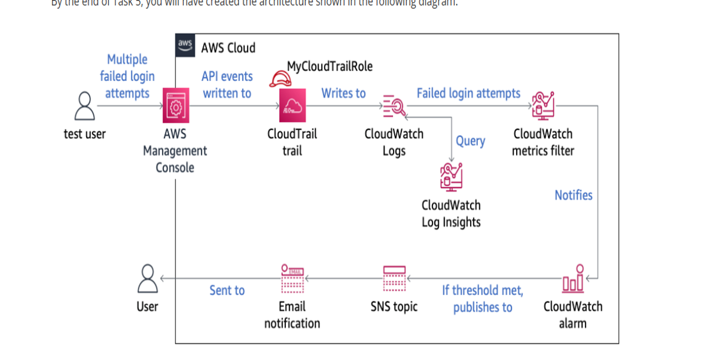
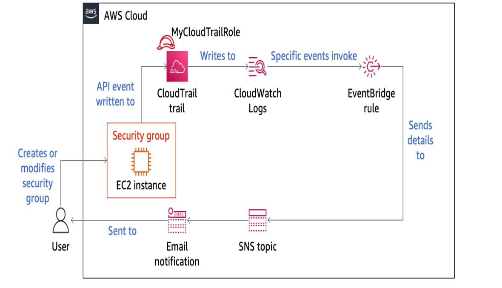
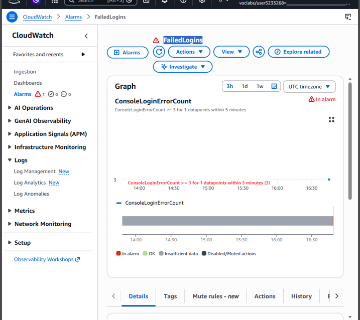

# AWS Cloud Security & Automated Threat Detection Lab

## Project Overview
This project demonstrates an end-to-end cloud security monitoring, threat detection, and event analysis pipeline built natively on AWS. The environment is configured to capture unauthorized login attempts and infrastructure configuration changes in real time, triggering immediate alerts and enabling forensic log analysis.

---

## System Architecture

### 1. Failed Login Detection Architecture
Captures failed login attempts via AWS CloudTrail, passes them to CloudWatch Logs, triggers a CloudWatch Metric Filter and Alarm, and sends an alert email using Amazon SNS.



### 2. Security Group Modification Alerting Architecture
Monitors API activity for unauthorized modifications to EC2 Security Groups using Amazon EventBridge rules and alerts administrators immediately via Amazon SNS.



---

## Lab Implementation & Configuration Details

### Task 1: Monitoring Failed Login Attempts
- **AWS CloudTrail Configuration:** Configured a multi-region trail (`MyCloudTrail`) logging to an S3 bucket and streamed directly to Amazon CloudWatch Log Groups.
- **Metric Filter Setup:** Created a custom CloudWatch metric filter for `ConsoleLogin` events where `errorMessage = "Failed authentication"`.
- **CloudWatch Alarm:** Set up a threshold alarm (`ConsoleLoginErrorCount >= 3` within 5 minutes) that transitions into the `ALARM` state.
- **Amazon SNS Integration:** Configured an SNS Topic with Email subscriptions to send automated notifications when unauthorized login thresholds are reached.

#### Evidence: CloudWatch Alarm Triggered (In Alarm State)


---

### Task 2: Detecting Security Group Modifications
- **Amazon EventBridge Rule:** Configured an EventBridge pattern matching `AuthorizeSecurityGroupIngress`, `RevokeSecurityGroupIngress`, and `CreateSecurityGroup` API calls.
- **Automated Alerting:** Linked the EventBridge pattern directly to the SNS Notification Topic to deliver real-time security alerts upon firewall rule changes.

---

### Task 3: Forensic Analysis with CloudWatch Logs Insights
Using AWS CloudWatch Logs Insights, queried the raw CloudTrail logs to investigate suspicious activity and extract adversary details.

#### Query Executed:
```sql
fields @timestamp, eventName, sourceIPAddress, userIdentity.userName
Key Forensic Findings:
Targeted Account: test

Adversary Source IP: 86.108.37.194

Event Outcome: Failed authentication

Evidence: Logs Insights Analysis Result
AWS Services Used
AWS CloudTrail: API logging and activity auditing.

Amazon CloudWatch & Logs Insights: Log aggregation, custom metric filtration, alarm triggers, and interactive log queries.

Amazon EventBridge: Event-driven architecture for real-time security events.

Amazon SNS (Simple Notification Service): Automated email notification dispatch.

AWS IAM: Access control and role permissions (MyCloudTrailRole).


| filter eventName = 'ConsoleLogin' and errorMessage = 'Failed authentication'
| sort @timestamp desc
